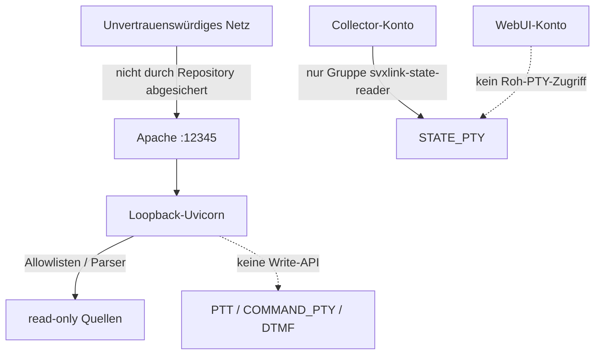

# Sicherheit und Berechtigungsgrenzen

## Sicherheitsmodell

Das Sicherheitsziel des aktuellen Stands ist Beobachtung mit minimaler lokaler Berechtigung. Die Anwendung ist nicht als Steueroberfläche implementiert. Sie bindet Uvicorn an Loopback; Apache ist die einzige vorgesehene Netzgrenze. Der mitgelieferte Apache-VHost veröffentlicht jedoch Klartext-HTTP auf `:12345` und enthält weder TLS noch Benutzer-/Netzwerkzugriffsbeschränkungen. Betreiber müssen eine geeignete vorgelagerte Netz-, VPN- und/oder TLS-/Identitätsgrenze selbst ergänzen, bevor sie den Dienst außerhalb eines vertrauenswürdigen Netzes veröffentlichen.

## Identitäten und Rechte

| Identität | Belegte Rechte / Aufgabe |
|---|---|
| `svxlink-webui` | Uvicorn-Dienst; liest nur die vom Betriebssystem erlaubten Quellen und das JSONL-Snapshot. |
| `svxlink-state-collector` | Eigener Dienstnutzer, primäre Gruppe `svxlink-webui`, ergänzend `svxlink-state-reader`; liest nach Binder-Freigabe den konfigurierten Roh-STATE_PTY und schreibt das Laufzeit-Snapshot. |
| root / Binder | `svxlink-state-pty-permissions.service`; wird an `svxlink.service` gebunden und setzt am akzeptierten Gerät Gruppe und Modus. |
| Apache | Statische Auslieferung und Reverse Proxy; Zugriffspolitik ist Betreiberverantwortung. |

Der Collector besitzt keinen Shell-/Subprocess- oder PTY-Write-Code. `svxlink-webui` hat keinen Roh-PTY-Zugriff. Weder Konto darf Zugriff auf `COMMAND_PTY`, DTMF oder PTT erhalten. Das Collector-Snapshot wird mit Modus `0640` als `svxlink-state-collector:svxlink-webui` erstellt.

## Datenminimierung

Konfiguration und Node-Datei werden anhand fester Schlüsselallowlisten gefiltert. Logs werden auf bekannte reguläre Muster reduziert. Die API liefert keine Zugangsdaten, Rohkonfiguration oder Rohlogs. Die FM-Funknetz-URL-Validierung akzeptiert ausschließlich die beiden fest kodierten HTTPS-Pfade und folgt keinen Redirects.

## Bekannte Angriffs- und Betriebsgrenzen

- Die CORS-Policy `allow_origins=["*"]` bedeutet nicht, dass eine Veröffentlichung sicher ist. Sie ersetzt keine Authentifizierung.
- Das Repository installiert keinen TLS-Schlüssel, kein Zertifikat, keine Apache-AuthN/AuthZ-Regel und keine Firewallregel.
- `/api/system` gibt technische Hostinformationen aus. Er soll daher nur innerhalb der vorgesehenen Vertrauensgrenze erreichbar sein.
- Externe Feed-Felder sind kein stabiler, im Repository definierter Vertrag und dürfen nicht als Steuer- oder Identitätsdaten verwendet werden.

## Vorgaben für eine zukünftige TG-Steuerung

Kontrolle bleibt deaktiviert. Vor einer späteren Implementierung verlangt das Projekt mindestens: TLS-Terminierung, starke AuthN/AuthZ (bevorzugt mTLS/VPN oder OIDC mit RBAC), ein root-eigenes `/etc/svxlink-webui/control.env` mit Modus `0600`, numerische `SVXLINK_TG_ALLOWLIST`, restriktiven lokalen DTMF-PTY-Zugriff und eine korrelierte neue SvxLink-Logbestätigung. Das Repository enthält keine Zugangsdaten und keine solche Route.

Weiter: [Installation](installation.md) · [STATE_PTY-Architektur](architecture.md)
